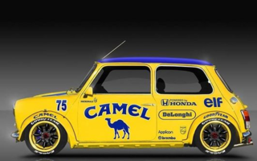

# BayerClash

Trammage ordonné avec une palette de 16 couleurs non régulièrement espacées avec contrainte color-clash des ordinateurs Thomson MO5 MO6 de 2 couleurs max par bloc de 8 pixels horizontaux. 
Sur MO6, recherche d'une palette de 16 couleurs optimale sur 4096.

  <table>
    <tr><td>MO6 / KNOLL / Matrice 8x8</td><td></td><td></td><td></td></tr>
  </table>

