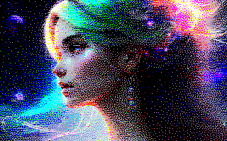
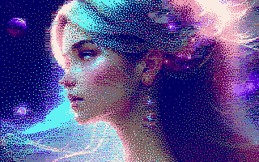

# BayerClash

**Conversion C du plugin LUA https://github.com/Samuel-DEVULDER/UToPiC/blob/master/bayer4_mo5.lua**

&nbsp;

**Expérimentation de tramage ordonné avec une palette de 16 couleurs non regulièrement espacées.**

Avec les contraintes MO5 de 2 couleurs max par bloc horizontal de 8 pixels sur une palette de 16 couleurs:

Avec une matrice 8x8 standard :

Avec une matrice [blue noise](https://github.com/matejlou/SimpleBlueNoise) :

Avec les contraintes MO6 de 2 couleurs max par bloc horizontal de 8 pixels sur une palette de 4096 couleurs:

Avec une matrice 8x8 standard :

Avec une matrice [blue noise](https://github.com/matejlou/SimpleBlueNoise) :

# Liens
- [UToPic](https://github.com/Samuel-DEVULDER/UToPiC)
- [tetrapal](https://github.com/matejlou/tetrapal)
- [exoquant](https://github.com/exoticorn/exoquant)
- [C containers](https://github.com/bkthomps/Containers)
