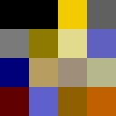
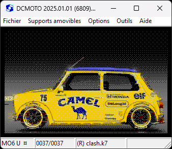

# BayerClash

Trammage ordonné avec une palette de 16 couleurs non régulièrement espacées avec contrainte color-clash des ordinateurs Thomson MO5 MO6 de 2 couleurs max par bloc de 8 pixels horizontaux. 

<table> <tr><td>A</td><td>B</td><td>C</td></tr> <tr><td>D</td><td>E</td><td>F</td></tr> </table>

&nbsp;
