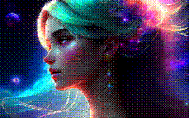
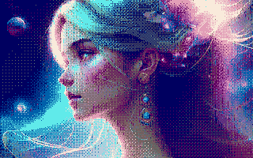
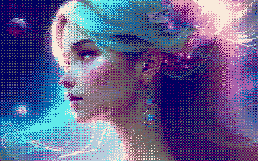

# BayerClash
Conversion C du plugin LUA https://github.com/Samuel-DEVULDER/UToPiC/blob/master/bayer4_mo5.lua

&nbsp;

Puis expérimentation de tramage ordonné avec une palette de 16 couleurs non regulièrement espacées.

Sans contraintes en rgb :

Avec les contraintes MO6 de 2 couleurs max par bloc horizontal de 8 pixels sur une palette de 4096 couleurs:

